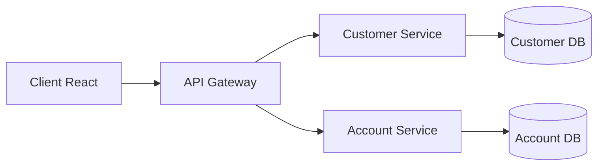

# 🏦 Bank Microservices

[](https://spring.io/projects/spring-boot)
[](https://spring.io/projects/spring-cloud)
[](https://reactjs.org)
[](https://www.typescriptlang.org)
[](https://mui.com)
[](https://www.docker.com/)

## 📋 À propos

Application bancaire moderne basée sur une architecture microservices, permettant la gestion des clients et de leurs comptes bancaires avec une interface utilisateur réactive et intuitive.

## 🎯 Objectifs du Projet

- Architecture microservices scalable
- Interface utilisateur moderne et responsive
- Gestion efficace des données bancaires
- Sécurité et validation des données
- Performance et haute disponibilité

## 🚀 Technologies

### Backend

-  Java 17
-  Spring Boot 3.4.2
-  Spring Cloud 2024.0.0
-  PostgreSQL
-  Docker
-  Maven

### Frontend

-  React 18
-  TypeScript 5
-  Material-UI 5
-  Vite
-  Axios

## 🏗️ Architecture



## 🌟 Fonctionnalités

### 👥 Gestion des Clients

- Création de nouveaux clients
- Modification des informations clients
- Suppression de clients
- Liste paginée avec recherche
- Validation des données clients

### 💰 Gestion des Comptes

- Création de comptes (Épargne/Courant)
- Consultation des soldes
- Limitation à 2 comptes par client
- Un seul compte de chaque type par client
- Historique des opérations

## 📥 Installation

### Prérequis

- Java 17+
- Node.js 18+
- Docker & Docker Compose
- Maven 3.8+
- PostgreSQL (via Docker)

### Cloner le Projet

```bash
git clone https://github.com/anwar-bouchehboun/App-Bancaire-en-Microservices.git
cd App-Bancaire-en-Microservices
```

### Configuration de la Base de Données

```bash
# Démarrer PostgreSQL et autres services
docker-compose up -d
```

### Démarrer les Microservices

```bash
# Customer Service
cd customer-service
./mvnw spring-boot:run

# Account Service (dans un nouveau terminal)
cd account-service
./mvnw spring-boot:run
```

### Lancer le Frontend

```bash
cd gestion-bancaire
npm install
npm run dev
```

## 🌐 Accès aux Services

- Frontend: http://localhost:5173
- Customer Service: http://localhost:8080/customer-service
- Account Service: http://localhost:8080/account-service
- Swagger UI:
  - Customer API: http://localhost:8080/customer-service/swagger-ui.html
  - Account API: http://localhost:8080/account-service/swagger-ui.html

## 🔒 Sécurité et Validation

- ✅ Validation des données entrantes
- 🛡️ Protection contre les injections SQL
- 🔄 Gestion des erreurs avec messages explicites
- 🔐 Sécurisation des endpoints
- 📝 Logging des opérations importantes

## 🐛 Gestion des Erreurs

- Messages d'erreur clairs et informatifs
- Validation côté client et serveur
- Gestion des cas limites
- Feedback utilisateur immédiat

## 🔄 CI/CD

- Tests automatisés
- Build et déploiement automatisés
- Conteneurisation avec Docker
- Environnements de développement/production

## 📈 Améliorations Futures

- [ ] Authentification JWT
- [ ] Service de notification
- [ ] Rapports et analytics
- [ ] Support multi-devises
- [ ] Application mobile

## 🤝 Contribution

Les contributions sont les bienvenues ! Pour contribuer :

1. Forkez le projet
2. Créez une branche (`git checkout -b feature/AmazingFeature`)
3. Committez vos changements (`git commit -m 'Add some AmazingFeature'`)
4. Pushez vers la branche (`git push origin feature/AmazingFeature`)
5. Ouvrez une Pull Request

## 📝 Licence

Ce projet est sous licence MIT. Voir le fichier [LICENSE](LICENSE) pour plus de détails.

## 👤 Auteur

**Anwar BOUCHEHBOUN**

- GitHub: [@anwar-bouchehboun](https://github.com/anwar-bouchehboun)
- LinkedIn: [Anwar BOUCHEHBOUN](https://www.linkedin.com/in/anwar-bouchehboun)
